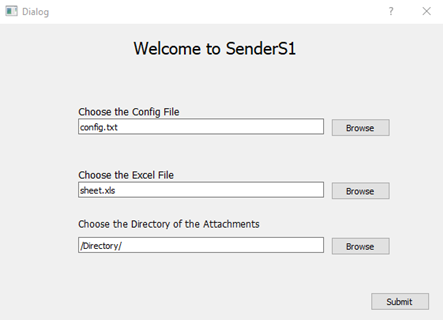
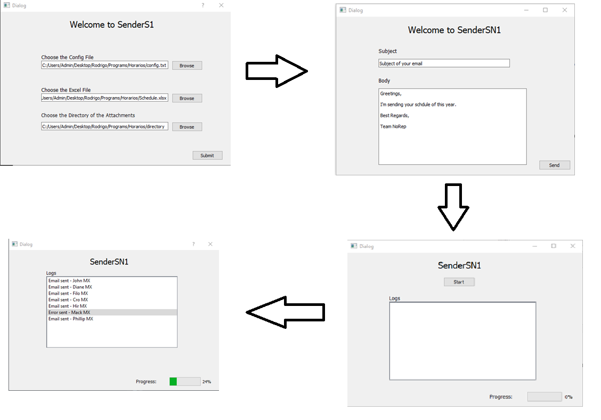

# Senders S1
## An app to send Schedule emails to your employees (Open Source)  

This application was created in Python and at this version only works for Gmail SMTP Servers, it's possible to change the code to other servers.

This application is available for Windows and MacOSX, its possible to download the setup, at the folder Setup.

## Demonstration

- Create a config file with your email address and password (You have an example (config.txt) at the folder SampleFiles)
- Insert all your employees at the excel file with their name, email address and name of the file that is the schedule of the employee (You have an example (Schedule.xlsx) at the folder SampleFiles)
- Set a directory with all the PDF/doc files of all schedules of the employers

##### Steps:
- Set the directories of the config, excel files and the directory that has all the schedules of your employers.
- Click Next, set the subject and the body of your email to send to all your employers
- Click Send, and click start to send the emails
- The program will show the logs of all emails that were sent and the ones that weren't sent for some reason.

## If you want the full documentation of this application, please contact this email: rodrigodsender@gmail.com
